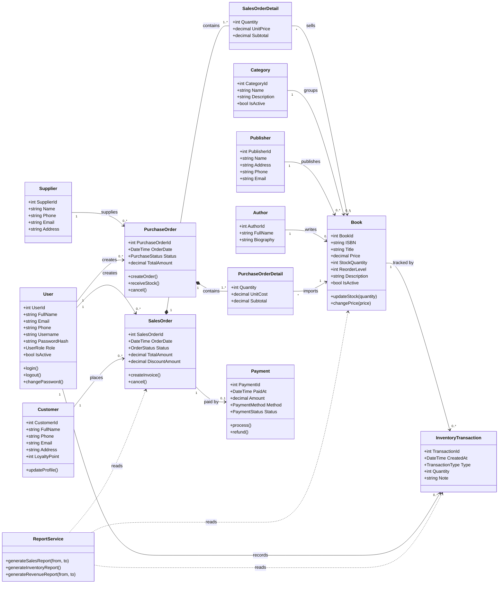
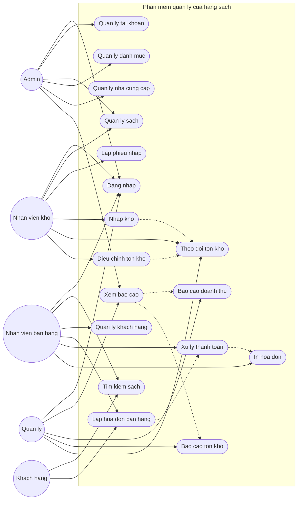

# Bookstore Management Diagrams

## Class Diagram

```mermaid
classDiagram
    direction LR

    class User {
        +int UserId
        +string FullName
        +string Email
        +string Phone
        +string Username
        +string PasswordHash
        +UserRole Role
        +bool IsActive
        +login()
        +logout()
        +changePassword()
    }

    class Customer {
        +int CustomerId
        +string FullName
        +string Phone
        +string Email
        +string Address
        +int LoyaltyPoint
        +updateProfile()
    }

    class Category {
        +int CategoryId
        +string Name
        +string Description
        +bool IsActive
    }

    class Publisher {
        +int PublisherId
        +string Name
        +string Address
        +string Phone
        +string Email
    }

    class Author {
        +int AuthorId
        +string FullName
        +string Biography
    }

    class Book {
        +int BookId
        +string ISBN
        +string Title
        +decimal Price
        +int StockQuantity
        +int ReorderLevel
        +string Description
        +bool IsActive
        +updateStock(quantity)
        +changePrice(price)
    }

    class Supplier {
        +int SupplierId
        +string Name
        +string Phone
        +string Email
        +string Address
    }

    class PurchaseOrder {
        +int PurchaseOrderId
        +DateTime OrderDate
        +PurchaseStatus Status
        +decimal TotalAmount
        +createOrder()
        +receiveStock()
        +cancel()
    }

    class PurchaseOrderDetail {
        +int Quantity
        +decimal UnitCost
        +decimal Subtotal
    }

    class SalesOrder {
        +int SalesOrderId
        +DateTime OrderDate
        +OrderStatus Status
        +decimal TotalAmount
        +decimal DiscountAmount
        +createInvoice()
        +cancel()
    }

    class SalesOrderDetail {
        +int Quantity
        +decimal UnitPrice
        +decimal Subtotal
    }

    class Payment {
        +int PaymentId
        +DateTime PaidAt
        +decimal Amount
        +PaymentMethod Method
        +PaymentStatus Status
        +process()
        +refund()
    }

    class InventoryTransaction {
        +int TransactionId
        +DateTime CreatedAt
        +TransactionType Type
        +int Quantity
        +string Note
    }

    class ReportService {
        +generateSalesReport(from, to)
        +generateInventoryReport()
        +generateRevenueReport(from, to)
    }

    User "1" --> "0..*" SalesOrder : creates
    Customer "1" --> "0..*" SalesOrder : places
    SalesOrder "1" *-- "1..*" SalesOrderDetail : contains
    SalesOrderDetail "*" --> "1" Book : sells
    SalesOrder "1" --> "0..1" Payment : paid by

    Category "1" --> "0..*" Book : groups
    Publisher "1" --> "0..*" Book : publishes
    Author "1" --> "0..*" Book : writes

    Supplier "1" --> "0..*" PurchaseOrder : supplies
    User "1" --> "0..*" PurchaseOrder : creates
    PurchaseOrder "1" *-- "1..*" PurchaseOrderDetail : contains
    PurchaseOrderDetail "*" --> "1" Book : imports

    Book "1" --> "0..*" InventoryTransaction : tracked by
    User "1" --> "0..*" InventoryTransaction : records
    ReportService ..> SalesOrder : reads
    ReportService ..> Book : reads
    ReportService ..> InventoryTransaction : reads
```

## Use Case Diagram

```mermaid
flowchart LR
    admin((Admin))
    staff((Nhan vien ban hang))
    warehouse((Nhan vien kho))
    customer((Khach hang))
    manager((Quan ly))

    subgraph system ["Phan mem quan ly cua hang sach"]
        login(["Dang nhap"])
        manageUsers(["Quan ly tai khoan"])
        manageBooks(["Quan ly sach"])
        manageCategories(["Quan ly danh muc"])
        manageCustomers(["Quan ly khach hang"])
        searchBooks(["Tim kiem sach"])
        createSale(["Lap hoa don ban hang"])
        processPayment(["Xu ly thanh toan"])
        printInvoice(["In hoa don"])
        manageSuppliers(["Quan ly nha cung cap"])
        createPurchase(["Lap phieu nhap"])
        receiveStock(["Nhap kho"])
        trackInventory(["Theo doi ton kho"])
        adjustStock(["Dieu chinh ton kho"])
        viewReports(["Xem bao cao"])
        salesReport(["Bao cao doanh thu"])
        inventoryReport(["Bao cao ton kho"])
    end

    admin --> login
    staff --> login
    warehouse --> login
    manager --> login

    admin --> manageUsers
    admin --> manageBooks
    admin --> manageCategories
    admin --> manageSuppliers
    admin --> viewReports

    staff --> searchBooks
    staff --> manageCustomers
    staff --> createSale
    staff --> processPayment
    staff --> printInvoice

    warehouse --> manageBooks
    warehouse --> createPurchase
    warehouse --> receiveStock
    warehouse --> trackInventory
    warehouse --> adjustStock

    manager --> viewReports
    manager --> salesReport
    manager --> inventoryReport
    manager --> trackInventory

    customer --> searchBooks
    customer --> createSale

    createSale -.-> processPayment
    processPayment -.-> printInvoice
    receiveStock -.-> trackInventory
    adjustStock -.-> trackInventory
    viewReports -.-> salesReport
    viewReports -.-> inventoryReport
```

